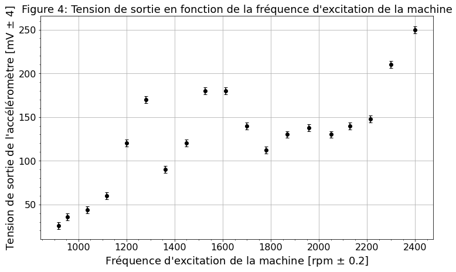
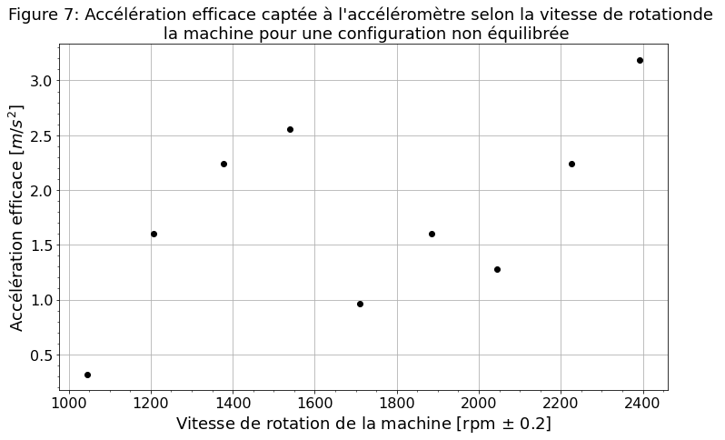
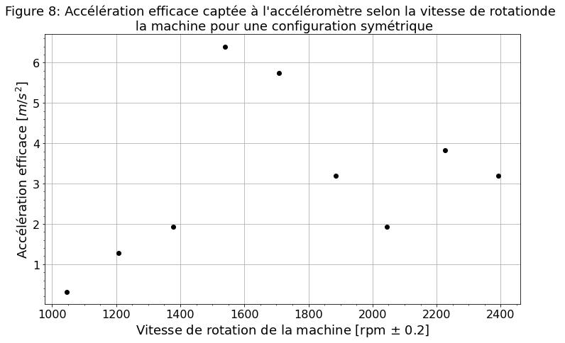

<br/><br/><br/><br/>
<h3><center> Cahier de laboratoire </center></h3><br/><br/><br/><br/><br/>
    
<center> Travaux pratiques avancés (GPH-3000) </center> <br /><br/><br/><br/><br/><br/>

<center> présenté à </center>
<center> Simon Rainville et Michel Piché </center> <br /><br/><br/><br/><br/><br/>

<center> par </center>
<center> Maxence Larose (111 188 447 - maxence.larose.1@ulaval.ca) </center>
<center> Pierre-Olivier Janvier (111 187 987 - pierre-olivier.janvier.1@ulaval.ca) </center><br /><br/><br/><br/><br/><br/><br/>

<center> Automne 2020 </center><br/><br/><br/>

<div style="page-break-after: always;"></div>

# Expérience 8 : Vibration de machine tournante

Protocole de laboratoire [disponible ici](https://sitescours.monportail.ulaval.ca/contenu/sitescours/036/03613/202009/site121785/modules809962/module1031409/page2793325/bloccontenu2672861/GPH-3000-A2016-Vibrations.pdf?identifiant=d321a24033e6ee9b172b82749f9449d4768e2162).

## Préparation

**Date de préparation :** 11 novembre 2020

**Date de l'expérimentation :** 1 novembre  2020

**But : Mesurer et étudier les différents types de vibrations trouvées dans une machine tournante** 

**Objectifs spécifiques :**
- Mesurer l'accélération de la machine tournante
- Mesurer la fréquence de résonance
- Observer et mesurer les différents modes de vibration
- Mesurer une vibration verticale
- Mesurer la vitesse des déplacements causés par les vibrations
- Mesurer les déplacements causés par les vibrations
- Filtrer un signal afin d'obtenir des composantes spécifiques
- Analyser spectralement le signal à l'aide d'un analyseur spectral


**Matériel nécessaire :**
- Rotor
- Masses
- Accéléromètres
- Convertisseur Q $\rightarrow$ V
- Oscilloscope
- Voltmètre
- Filtre ajustable
- Analyseur spectral

**Schéma de montage :**

<center> FIGURE 1 : Montage pour la prise de mesure d'accélérations.  </center> <br/>


<center> FIGURE 2 : Montage pour la prise d'une vibration globale.  </center> <br/>


<center> FIGURE 3 : Montage pour le filtrage du signal .  </center> <br/>

## Réalisation
### Mesures d’accélérations
1. Réaliser le montage de la figure 1, on utilise une amplification de $x5~\pm~3~\%$ et l'accéléromètre possède une sensibilité de sensibilité 3.13 pC/m/s^2

2. On mesure l'accélération maximale mesurée à l'accélèromètre lorsque le moteur tourne à 1000 rpm. On obtient alors une accélération de $(40~\pm~8)~mV$ donc de $(2.6~\pm~0.5)~m/s^2$ pour une vitesse de rotation de $(1000.3~\pm~0.2)~rpm$ lorsque le moteur est alimenté par une tension de $(13.59~\pm~0.02)~V$. 

3. On enlève la masse non équilibrée, il ne reste que du bruit électronique pour la mesure de vibration. Cela nuit alors à la mesure de vibration du rotor.

4. On ajoute maintenant deux masses non équilibrées sur le système et on s'intéresse à la fréquence de résonance du système. On mesure alors la tension de sortie de l'accéléromètre en fonction de la fréquence d'excitation du rotor. Les mesures sont placé dans le tableau 1 et la figure associée est présentée à la figure 4.

|  Tension d'alimentation du rotor [$V~\pm~0.02$]   |Fréquence d'excitation du moteur [rpm $\pm$ 0.2]  | Tension de sortie [mV $\pm$ 4]  |
|:-----:|:---:|:---:|
|  11   | 917   | 26  |
|  13   | 954   | 36  |
|  14   | 1036  | 44  |
|  15   | 1117  | 60  |
|  16   | 1200  | 120 |
|  17   | 1280  | 170 |
|  18   | 1362  | 90  |
|  19   | 1449  | 120 |
|  20   | 1527  | 180 |
|  21   | 1611  | 180 |
|  22   | 1700  | 140  |
|  23   | 1781  | 112  |
|  24   | 1868  | 130  |
|  25   | 1957  | 138  |
|  26   | 2050  | 130  |
|  27   | 2128  | 140  |
|  28   | 2215  | 148  |
|  29   | 2300  | 210  |
|  30   | 2400  | 250  |

<center> Tableau 1  : Tension de sortie de l'accéléromètre en fonction de la fréquence d'excitation du moteur.  </center> <br/>


```python
%matplotlib inline
import numpy as np
import matplotlib.pyplot as plt

filename="Data/mesuresacc.txt"

x0 = np.loadtxt(filename, usecols=(0))
x1 = np.loadtxt(filename, usecols=(1))
y1 = np.loadtxt(filename, usecols=(2))


pltTransExp = plt.errorbar(x1, y1, yerr=4, xerr=0.2, linestyle="",
                           marker="o", markersize=6, label="", capsize=3, ecolor='k', markeredgecolor = 'k',
                           markerfacecolor='k')
plt.yticks(fontsize = 16)
plt.xticks(fontsize = 16)
plt.xlabel("Fréquence d'excitation de la machine [rpm $\pm$ 0.2]", fontsize = 18)
plt.ylabel("Tension de sortie de l'accéléromètre [mV $\pm$ 4]", fontsize = 18)
plt.grid()
plt.minorticks_on()
plt.title("Figure 4: Tension de sortie en fonction de la fréquence d'excitation de la machine", fontsize = 18)
fig = plt.gcf()
fig.set_size_inches(12, 7)
plt.show()
```





Selon les données recueillies, on obtient une fréquence de résonance approximative de 1250 rpm. La cause de cette approximation peut être expliqué par le fait que plusieurs autres objets environnants vibraient aussi lorsque le rotor était en marche. Par exemple, la table et les instruments vibraient aussi. Cela impacte donc grandement la mesure la fréquence de résonance du système. Pour le système à résonnance, on obtient alors une accélération de $7.66~m/s^2$.

5. La force résultante sur les supports est donnée par la multiplication de la masse des éléments sur les supports par l'accélération. Cela donne alors une force de 45.96 N. Non, considérant que les support sont fait de métal, une force d'une telle amplitude ne présente pas de risque.

###  Recherche de modes de vibration
1. On enlève d'amplificateur du montage et on ajoute un accéléromètre au système. On souhaite maintenant comparer la valeur maximale obtenue par chacun des signaux des accéléromètres afin de déterminer les modes de vibrations de la machine. 

2. On fait tourner la machine à 1201 rpm donc à 16~V. On mesure l'amplitude des signaux obtenues aux accéléromètres. Pour l'accéléromètre A on obtient $(28~\pm~4)~mV$ et pour l'accéléromètre B on obtient $(24~\pm~4)~mV$. Les deux signaux sont en phase, on peut donc affirmer que le mode de vibration dans ce cas-ci est celui d'une machine qui vibre comme un tout, de haut en bas.

3. On place à la suite, les deux masses sur la machine en position opposées afin de créer un équilibre statique, mais un déséquilibre dynamique. En survolant la plage de tension possible, on observe une fréquence de résonance qui serait de  $(1615~\pm~0.2)~rpm$ avec une alimentation de $(21.00~\pm~0.02)~V$. La tension crête du A est de $(40~\pm~4)~mV$ et le B est de $(20~\pm~4)~mV$, leur phase sont déphasées de pi. Il y a donc de l'interférence destructive.


<center> FIGURE 5 : Observation du mode de vibration de la machine tournante en équilibre statique mais en déséquilibre dynamique.  </center> <br/>

On peut alors dire que le mode de vibration est différent que celui observé précédemment et que la machine ne vibre que d'un côté. La figure 6 montre approximativement le mode de vibration trouvé.


<center> FIGURE 6 : Dessin du mode de vibration de la machine.  </center> <br/>

Dans cette figure, les points oranges représentent les masses de la machine, le point bleu le rotor, les murs les accéléromètres et la corde l'axe de la machine. On peut alors observer un mode de vibration s'apparentant à la première harmonique. La réponse aux accéléromètres serait la force résultante sur les murs. On peut aussi remarquer que les amplitudes captés par les deux accéléromètres ne sont pas les mêmes. Cela pourrait être expliqué par le fait que les masses peuvent être légèrement différentes ou que le système n'est pas symétrique. De plus, on n'observe pas de phénomène de battement.

### Mesure d’une vibration globale
1. On réalise à présent le montage de la figure 2 et on place une masse non équilibrée dans le système.
2. On veut la vibration efficace en fonction de la vitesse de rotation, les mesures sont placées dans le tableau 2.

| Vitesse de rotation [$rpm~\pm~0.2$]  | Tension au voltmètre [$mV~\pm~4$] | vibration efficace [$m/s^2$] |
|:---:|:---:|:---:|
| 1045  | 1  | 0.32  |
| 1207  | 5  | 1.60  |
| 1377  | 7  | 2.24  |
| 1539  | 8  | 2.56  |
| 1709  | 3  | 0.96  |
| 1884  | 5  | 1.60  |
| 2045  | 4  | 1.28  |
| 2227  | 7  | 2.24  |
| 2393  | 10 | 3.19  |

<center> Tableau 2  : Accélération efficace captée à l'accéléromètre selon la vitesse de rotation de la machine pour une configuration non équilibrée.  </center> <br/>

3. On trace la courbe de l'accélération efficace en fonction de la vitesse de rotation du système. La courb est présenté à la figure 

4. On refait les mêmes mesures que précédemment, mais cette fois avec un système statiquement stable donc avec deux masses placées de manières inverses l'une à l'autre.

| Vitesse de rotation [$rpm~\pm~0.2$]  | Tension au voltmètre [$mV~\pm~4$] | vibration efficace [$m/s^2$] |
|:---:|:---:|:---:|
| 1045  | 1   | 0.32  |
| 1207  | 4   | 1.28  |
| 1377  | 6   | 1.92  |
| 1539  | 20  | 6.40  |
| 1709  | 18  | 5.75  |
| 1884  | 10  | 3.20  |
| 2045  | 6   | 1.92  |
| 2227  | 12  | 3.83  |
| 2393  | 10  | 3.19  |

<center> Tableau 3  : Accélération efficace captée à l'accéléromètre selon la vitesse de rotation de la machine pour une configuration symétrique.  </center> <br/>
Les courbes des deux derniers tableaux sont présentées aux figures 7 et 8.


```python
filename="Data/mesureseff.txt"
filename2 = "Data/mesureseff2.txt"

x0 = np.loadtxt(filename, usecols=(0))
y1 = np.loadtxt(filename, usecols=(2))


pltTransExp = plt.errorbar(x0, y1, yerr=0, xerr=0.2, linestyle="",
                           marker="o", markersize=6, label="", capsize=3, ecolor='k', markeredgecolor = 'k',
                           markerfacecolor='k')
plt.yticks(fontsize = 16)
plt.xticks(fontsize = 16)
plt.xlabel("Vitesse de rotation de la machine [rpm $\pm$ 0.2]", fontsize = 18)
plt.ylabel("Accélération efficace [$m/s^2$]", fontsize = 18)
plt.grid()
plt.minorticks_on()
plt.title("Figure 7: Accélération efficace captée à l'accéléromètre selon la vitesse de rotation" 
          "de \n la machine pour une configuration non équilibrée", fontsize = 18)
fig = plt.gcf()
fig.set_size_inches(12, 7)
plt.show()

x0 = np.loadtxt(filename2, usecols=(0))
y1 = np.loadtxt(filename2, usecols=(2))


pltTransExp = plt.errorbar(x0, y1, yerr=0, xerr=0.2, linestyle="",
                           marker="o", markersize=6, label="", capsize=3, ecolor='k', markeredgecolor = 'k',
                           markerfacecolor='k')
plt.yticks(fontsize = 16)
plt.xticks(fontsize = 16)
plt.xlabel("Vitesse de rotation de la machine [rpm $\pm$ 0.2]", fontsize = 18)
plt.ylabel("Accélération efficace [$m/s^2$]", fontsize = 18)
plt.grid()
plt.minorticks_on()
plt.title("Figure 8: Accélération efficace captée à l'accéléromètre selon la vitesse de rotation" 
          "de \n la machine pour une configuration symétrique", fontsize = 18)
fig = plt.gcf()
fig.set_size_inches(12, 7)
plt.show()
```








###  Mesure de la vitesse et du déplacement
1. On utilise le même montage qu'à la figure 2, mais en remplaçant le voltmètre par un oscilloscope et en enlevant une des deux masses de la machine. On effectue alors une intégration du système afin d'obtenir la vitesse et non l'accélération aux accéléromètres.

2. À une vitesse de rotation de $(1200.6~\pm~0.2)~rpm$, on obtient une vitesse de $(8.40~\pm~4)~mV/100$.

3. Avec le signal de vitesse, on peut aussi calculer le déplacement. Le signal s'apparentant à une sinusoïde de 20~Hz et une amplitude de $(17~\pm~4)~mV/100$, le déplacement sera donné par l'intégrale de cela. On obtient alors un déplacement maximal de 0.22 mm.

4. On refait la mesure du déplacement pour la rotation à la résonance du système. Donc à $(1250~\pm~0.2)~rpm$, on obtient un signal de vitesse sinusoïdal de 20.68 Hz de fréquence et de $(24.80~\pm~4)~mV/100$ mV d'amplitude. Cela nous donne un déplacement de 0.30 mm. Cela n'est donc pas assez pour briser ou gravement endommager la machine.

### Filtrage du signal
1. On réalise le montage de la figure 3. 

2. On fait tourner la machine à 1500 rpm et l'amplificateur est ajusté pour avoir au moins 1 V de signal au filtre.
L'amplificateur est ajusté à $50x~\pm~3~\%$. On veut isoler les deux composantes sinusoïdales les plus importantes du signal. Pour ce faire, on isole la fréquence fondamentale avec un filtre passe-bas et la deuxième composante avec un filtre passe-bande

3. On choisi des paramètres du filtre pour faire en sorte d'isoler la fréquence fondamentale du signal. La fréquence après filtrage est de 25 Hz et le signal possède une amplitude crête-à-crête 288~mV. Le filtre utilisé est un filtre passe-bas possèdant un gain de 1 et une fréquence de coupure de 32 Hz.

4. Pour la deuxième composante, il n'a pas été possible de l'isoler, car la fréquence fondamentale est trop importante.

###  Analyse spectrale du signal
1. On remplace le filtre et l'oscilloscope par un analyseur de fréquence.
2. On observe le spectre obtenu à l'aide de l'analyseur de fréquence. Le spectre obtenu est présenté à la figure 7


<center> FIGURE 8 : Montage pour le filtrage du signal .  </center> <br/>

L'amplitude obtenue pour la composante fondamentale (25 Hz) est de -15.26 dBV. À 50 Hz, l'amplitude est de -35 dBV. À 75 Hz, l'amplitude est de -39 dBV.

Ainsi, la meilleure méthode à utiliser est par analyseur de spectre.
