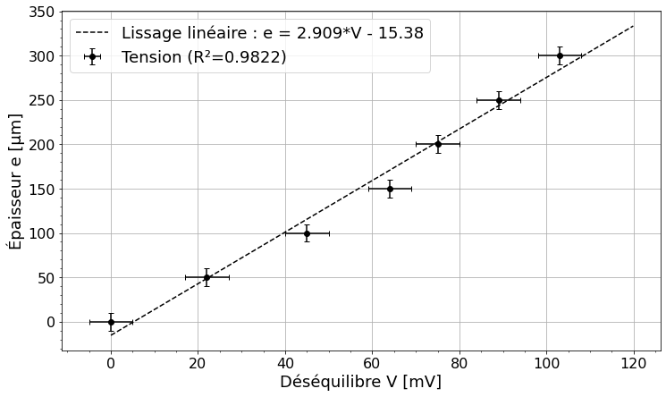
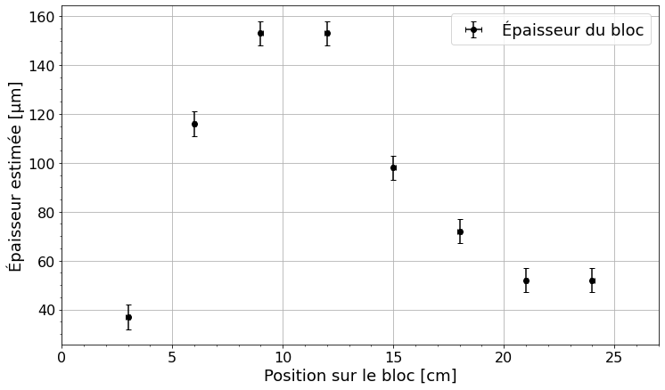

<br/><br/><br/><br/>
<h3><center> Cahier de laboratoire </center></h3><br/><br/><br/><br/><br/>

<center> Travaux pratiques avancés (GPH-3000) </center> <br /><br/><br/><br/><br/><br/>

<center> présenté à </center>
<center> Simon Rainville et Michel Piché </center> <br /><br/><br/><br/><br/><br/>

<center> par </center>
<center> Maxence Larose (111 188 447 - maxence.larose.1@ulaval.ca) </center>
<center> Pierre-Olivier Janvier (111 187 987 - pierre-olivier.janvier.1@ulaval.ca) </center><br /><br/><br/><br/><br/><br/><br/>

<center> Automne 2020 </center><br/><br/><br/>

<div style="page-break-after: always;"></div>

# Expérience 1 : Contrôle des matériaux

Protocole de laboratoire [disponible ici](https://sitescours.monportail.ulaval.ca/contenu/sitescours/036/03613/202009/site121785/modules809962/module1031408/page2793323/bloccontenu2672857/GPH-3000-A2016-Mat%C3%A9riaux.pdf?identifiant=f9749d3368d2fe5b4a6f96240569af01f8750ab3).

## Préparation

**Date de préparation :** 16 septembre 2020

**Date de l'expérimentation :** 17 septembre 2020

**Coéquipier :** Pierre-Olivier Janvier

**But :** Étudier le phénomène des échos et leur atténuation dans différents matériaux. Se familiariser avec la méthode des courants induits, puis l'appliquer à la détection de fissures et à la mesure de l'épaisseur d'un revêtement.

**Objectifs spécifiques :**
- Mesurer l'épaisseur d'un matériau à l'aide d'ultrasons et comparer aux mesures faites avec un règle graduée.
- Mesurer l'épaisseur dans le cas où la surface du matériau est courbée.
- Déterminer la forme d'une cavité à l'aide de mesure d'échos.
- Déterminer l'atténuation des ondes sonoresdans différents matériaux.
- Détecter l'orientation et la longueur d'une fissure à l'aide des courants de Foucault.
- Mesurer l'épaisseur d'un revêtement sur une surface métallique avec de courants induits.

**Matériel nécessaire :**
- Générateur d'ultrasons
- Matériau piéxoélectrique
- Source de tension pulsée (tension d‘excitation d’environ 300 volts, avec une durée de 70 ns et un taux de répétition de 1000 Hz).
- Transducteurs (fréquence de désexcitation d’environ 3.5 MHz et d'une durée de 3 à 4 cycles).
- Bobine d'exploration (circulaires, diamètre de 14 mm, 60 tours de fil et inductance de 79 µH).
- Impédancemètre
- Amplificateur différentiel avec un gain de 200
- Redresseurs synchrones à simple alternance
- Amplificateurs ajustables avec un gain de 1 ou 10
- Oscilloscope XY.

**Schéma des montages :**


<center> FIGURE 1 : Schéma du système de mesure de l'épaisseur du cylindre à l'aide d'ultrasons.  </center> <br/>


<center> FIGURE 2 : Schéma du système de mesure de l'atténuation de différents matériaux.  </center> <br/>


<center> FIGURE 3 : Assemblage fait d'un bloc d'aluminium utilisé pour la mesure de la détection de fissures.  </center> <br/>


<center> FIGURE 4 : Schéma du système permettant de mesurer l'épaisseur d'un revêtement par courants de Foucault.  </center> <br/>

## Réalisation

### Ultrasons

#### Mesure d'une épaisseur

1. On réalise le montage présenté à la figure 1.
2. Une substance visqueuse ("Multi-purpose ultrasound gel") est appliquée entre le transducteur et le cylindre d'aluminium. L'utilité d'une telle substance est d'assurer un bon contact entre ces deux objets pour que la propagation des échos soit bonne. En effet, il est nécessaire de combler les vides d'air qui pourraient se former entre les surfaces des deux objets et qui pourraient provoquer la détérioration de la qualité des ultrasons (par atténuation, réflexion, etc.).
3. Le temps $\Delta t$ entre les échos est mesuré à l'oscilloscope. Le temps entre 4 échos est mesuré et la moyenne des temps mesurée est de $(7.7~\pm~0.5)~\mu$s. La vitesse $v$ des ultrasons dans l’aluminium est connue et est d’environ 6300 m/s. Il est donc possible de déterminer l’épaisseur $e$ du cylindre à l'aide de l'équation suivante :
\begin{equation} 
e = \frac{1}{2}v \Delta t = \frac{1}{2}(6300~\text{m/s})(7.7 \times 10^{-6}~\text{s}) = (2.4~\pm~0.3)~\text{cm}.
\end{equation}
4. L'épaisseur du cylindre est mesuré avec une règle et est égale à (2.5 $\pm$ 0.1) cm, ce qui correspond à l'épaisseur mesurée.
5. Les étapes 3 et 4 sont répétées pour toutes les épaisseurs disponibles en laboratoire et les résultats sont présentés dans le tableau suivant : 


| Bloc | Épaisseur mesurée (règle) [cm] | $\Delta t$ [$\mu$s] | Épaisseur obtenue par ultrasons [cm]|
|:----:|:------------------------------:|:-------------------:|:-------------------------------:|
|  # 1 |         2.5 $\pm$ 0.1          |    7.7 $\pm$ 0.5    |         2.4 $\pm$ 0.3         |
|  # 2 |           5 $\pm$ 0.1          |    15.5 $\pm$ 0.5   |         4.8 $\pm$ 0.2         |
|  # 3 |          7.5 $\pm$ 0.1         |    23.4 $\pm$ 0.5   |         7.3 $\pm$ 0.2         |

<center>TABLEAU 1 : Épaisseur du cylindre mesurée avec la règle vs épaisseur mesurée avec ultrasons </center>

La plus petite épaisseur mesurable avec cette méthode correspond à la longueur d'onde du signal envoyé par le transducteur. La fréquence du transducteur $f$ est de $3.5$ MHz. Il est donc possible de calculer la longueur d'onde $\lambda$ avec l'équation suivante :
$$
\lambda = \frac{v}{f} = \frac{6300~\text{m/s}}{3.5 \text{MHz}} = 1.8~\text{mm}.
$$
Il est d'ailleurs possible d'essayer de mesurer une plaque de 1 mm d'épaisseur et on remarque qu'il n'y a pas d'écho de retour visible à l'oscilloscope. L'écho de retour est en fait superposé à l'écho initial.

#### Réflexion sur une surface courbée

1. Le transducteur est placé sur le bloc d’aluminium avec une surface courbée. La base du bloc est de ($3.5~\pm~0.1$) cm, la hauteur est de ($7.0~\pm~0.1$) cm et le bras du bloc est de ($3.5~\pm~0.1$) cm (le bloc est symétrique!).

2. Le temps qui s’écoule entre l’impulsion initiale et le premier écho est mesuré pour 6 positions différentes et l’épaisseur du bloc est calculé à l'aide de l'équation 1. Les résultats sont présentés dans le tableau suivant.

|    Position [cm]   | $\Delta t$ [$\mu$s] | Épaisseur obtenue par ultrasons [cm] |
|:--------------:|:-------------------:|:------------------------------------:|
| 1 $\pm$ 0.1 cm |    21.9 $\pm$ 0.5   |            6.9 $\pm$ 0.2           |
| 2 $\pm$ 0.1 cm |    21.9 $\pm$ 0.5   |            6.9 $\pm$ 0.2           |
| 3 $\pm$ 0.1 cm |    21.9 $\pm$ 0.5   |            6.9 $\pm$ 0.2           |
| 4 $\pm$ 0.1 cm |          -          |                   -                  |
| 5 $\pm$ 0.1 cm |          -          |                   -                  |
| 6 $\pm$ 0.1 cm |    11.1 $\pm$ 0.5   |            3.5 $\pm$ 0.2           |

<center>TABLEAU 2 : Délai entre deux échos en fonction de la position du transducteur sur le bloc </center>

3. On remarque qu'auncun écho n'a été détecté pour les positions 4 et 5, ce qui correspond au position où le transducteur est placé directement au-dessus de la partie courbée. Il est donc clair que la courbure vient biaisé nos mesures puisque la réflexion produite est oblique à la surface et, dans le cas où il a multiples réflexions, le signal peut même être perdu. 

#### Détection d’une cavité

1. Les dimensions du bloc sont de (12.5 cm $\times$ 12.5 cm $\times$ 3.8 cm). Afin de sonder la pièce à l’aide du transducteur, la pièce est quadrillée à 16 positions différentes ce qui permet d'obtenir une matrice de l'épaisseur mesurée. Par exemple, la position (1,1) correspond à la position (2.5 cm $\times$ 2.5 cm) alors que la position (3,4) correspond à la position (7.5 cm $\times$ 10 cm). Les résultats sont présentés dans le tableau 3.

| Position | $\Delta t$ [$\mu$s] | Épaisseur calculée [cm] |
|:--------:|:-------------------:|:-----------------------:|
|   (1,1)  |    12.2 $\pm$ 0.5   |      3.8 $\pm$ 0.2      |
|   (1,2)  |    12.2 $\pm$ 0.5   |      3.8 $\pm$ 0.2      |
|   (1,3)  |    12.2 $\pm$ 0.5   |      3.8 $\pm$ 0.2      |
|   (1,4)  |    12.2 $\pm$ 0.5   |      3.8 $\pm$ 0.2      |
|   (2,1)  |    12.2 $\pm$ 0.5   |      3.8 $\pm$ 0.2      |
|   (2,2)  |    2.5 $\pm$ 0.5    |      0.8 $\pm$ 0.2      |
|   (2,3)  |    5.2 $\pm$ 0.5    |      1.6 $\pm$ 0.2      |
|   (2,4)  |    12.2 $\pm$ 0.5   |      3.8 $\pm$ 0.2      |
|   (3,1)  |    12.2 $\pm$ 0.5   |      3.8 $\pm$ 0.2      |
|   (3,2)  |    4.8 $\pm$ 0.5    |      1.5 $\pm$ 0.2      |
|   (3,3)  |    5.2 $\pm$ 0.5    |      1.6 $\pm$ 0.2      |
|   (3,4)  |    12.2 $\pm$ 0.5   |      3.8 $\pm$ 0.2      |
|   (4,1)  |    12.2 $\pm$ 0.5   |      3.8 $\pm$ 0.2      |
|   (4,2)  |    12.2 $\pm$ 0.5   |      3.8 $\pm$ 0.2      |
|   (4,3)  |    12.2 $\pm$ 0.5   |      3.8 $\pm$ 0.2      |
|   (4,4)  |    12.2 $\pm$ 0.5   |      3.8 $\pm$ 0.2      |

<center>TABLEAU 3 : Délai en fonction de la position sur le bloc. </center>

2. La forme de la cavité peut être estimée à l'aide des mesures prises. En effet, les mesures où l'épaisseur est plus faible que 3.8 cm correspondent à aux positions de la cavité. On remarque que la cavité a la forme d'un carré aux positions (2,2), (2,3), (3,2), (3,3). Si surface de la cavité n’avait pas été plane, la forme aurait été impossible à déterminer, tel que démontrer dans la sous-section précédente *Réflexion sur une surface courbée*.

#### Atténuation

1. Le montage de la figure 2 est réalisé. Les amplitudes des deux premiers pics pour chacun des échantillons de plastique acrylique sont mesurées et présentées dans le tableau 4. Le coefficient d'atténuation est aussi calculé pour chacun des blocs utilisés

|          Cylindre         | Amplitude pic #1 [mV] | Amplitude pic #2 [mV] | $\alpha$ [dB/cm] |
|:-------------------------:|:---------------------:|:---------------------:|:----------------:|
| Aluminium #1 (e = 2.5 cm) |      220 $\pm$ 5      |      212 $\pm$ 5      |        0.05 $\pm$ 0.02      |
| Aluminium #2 (e = 5.0 cm) |      128 $\pm$ 5      |       56 $\pm$ 5      |        0.70 $\pm$ 0.05      |
| Aluminium #3 (e = 7.5 cm) |      276 $\pm$ 10     |      132 $\pm$ 10     |        0.45 $\pm$ 0.05      |
| Acrylique #1 (e = 2.5 cm) |      188 $\pm$ 5      |       18 $\pm$ 1      |         4.1 $\pm$ 0.3      |
| Acrylique #2 (e = 5.0 cm) |    10000 $\pm$ 100    |       18 $\pm$ 1      |        6 $\pm$ 1       |
| Acrylique #3 (e = 7.5 cm) |    10000 $\pm$ 100    |       4 $\pm$ 1       |         5 $\pm$ 2       |

<center>TABLEAU 4 : Amplitudes des échos dans divers matériaux. </center>

2. Le coefficient d’absorption des matériaux peuvent être déterminé en effectuant la moyenne des coefficients obtenus dans le tableau 4. On obtient $\alpha_{\text{aluminium}}$ = $(0.4~\pm~0.1)$ dB/cm et $\alpha_{\text{acrylique}}$ = $(5~\pm~1)$ dB/cm. Le coefficient beaucoup plus grand pour l'acrylique peut s'expliquer par le fait que l’aluminium est un métal et qu'il possède une structure cristalline beaucoup plus ordonnée que l’acrylique, qui est un polymère amorphe. Les ondes se propagent donc beaucoup plus facilement dans l'aluminium.

3. On comprend qu'il est préférable de faire la mesure avec deux pics sur un même échantillon qu'avec des amplitudes données par deux échantillons différents. En effet, si il y a présence de défauts dans un des blocs, l'utilisation d'amplitudes provenant de deux blocs différents entraînera un biais sur la valeur calculée.

4. L'épaisseur maximale pouvant être mesurée pour l’acrylique est plus faible que 7.5 cm. En effet, à cette épaisseur, l'écho n'est presque plus visible et la mesure est donc difficile voir impossible. D'ailleurs, une distance de 7.5 cm correspond à une perte d'environ 37.5 dB, ce qui est énorme. Il n'est donc pas surprenant de ne pas pouvoir mesurer de signal à une telle distance.

6. Connaissant l’épaisseur d’un bloc d’acrylique et en mesurant le temps de propagation d’une impulsion dans le bloc, il est possible de calculer la vitesse approximative du son dans l’acrylique. Cette vitesse devrait être plus faible que la vitesse du son dans l'aluminium vu la grande atténuation dans l'acrylique. La vitesse du son $v_{\text{acrylique}}$ est donnée par

$$
v_{\text{acrylique}} = \frac{2 e}{\Delta t} = \frac{2 \times 7.5~\text{cm}}{54.8~\mu s} = 2737~\text{m/s}
$$

### Courants de Foucault

#### Mise en marche des appareils

1. L'ensemble des appareils sont mis en marche tel qu'indiqué dans le protocole de laboratoire.

#### Détection d’une fissure

1. Les deux bobines sont placées sur la partie gauche du bloc présenté à la figure 3. Le numéro du bloc est A.

2. L'appareil est équilibré (Pont de Wheatstone à l'équilibre) en plaçant les signaux au centre de l'écran de l'oscilloscope.

3. On sait que la partie de droite du bloc comporte une fissure. Il est possible de la détecter et de déterminer son orientation et sa longueur. En effet, en se déplaçant sur le bloc, on remarque des déplacements du curseur, surtout en V$\Delta$R. Le meilleur indicateur pour cette fissure dans cet alliage est V$\Delta$R.

### Mesure de l’épaisseur d’un revêtement

1. Le montage de la figure 4 est d'abord réalisé. L'appareil est équilibré avec les deux bobines sur le métal nu.

2. Une mince feuille de plastique est d'abord insérée sous la sonde, puis plusieurs feuilles jusqu'à une épaisseur d'environ 0.3 mm. Il est important de noter la déviation X et Y et le déséquilibre (Module de X et Y).

| Nombre de feuilles | Épaisseur <br />[$\pm$$10~\mu$m] | Déviation X <br />[$\pm~5$ mV] | Déviation Y <br />[$\pm~5$ mV] | Déséquilibre $(X^2 + Y^2)^{1/2}$ <br />[$\pm~5$ mV] |
| :----------------: | :------------------------------: | :----------------------------: | :----------------------------: | :-------------------------------------------------: |
|         0          |                0                 |               0                |               0                |                          0                          |
|         1          |                50                |              -10               |               20               |                         22                          |
|         2          |               100                |              -20               |               40               |                         45                          |
|         3          |               150                |              -40               |               50               |                         64                          |
|         4          |               200                |              -45               |               60               |                         75                          |
|         5          |               250                |              -60               |               66               |                         89                          |
|         6          |               300                |              -70               |               75               |                         103                         |
<center>TABLEAU 5 : Épaisseur de la pile de feuilles en fonction de la position. </center>

3. Le tableau 6 permet de tracer la courbe d’étalonnage présentée à la figure 5.


```python
%matplotlib inline
import numpy as np
import matplotlib.pyplot as plt
```


```python
# Polynomial Regression
def polyfit(x, y, degree):
    results = {}

    coeffs = np.polyfit(x, y, degree)

    # Polynomial Coefficients
    results['polynomial'] = coeffs.tolist()

    # r-squared
    p = np.poly1d(coeffs)
    # fit values, and mean
    yhat = p(x)
    ybar = np.sum(y) / len(y) 
    ssreg = np.sum((yhat - ybar) ** 2)
    sstot = np.sum((y - ybar) ** 2)
    results['determination'] = ssreg / sstot

    return results
```


```python
filename="Data/Déséquilibre_épaisseur.txt"

x1 = np.loadtxt(filename, usecols=(0))
y1 = np.loadtxt(filename, usecols=(1))

x = np.arange(0.0, 120, 0.1)
a = polyfit(x1, y1, 1)
z = np.polyfit(x1, y1, 1)
f = np.poly1d(z)

pltTransExp = plt.errorbar(x1, y1, yerr=10, xerr=5, linestyle="",
                           marker="o", markersize=6, label="Tension (R²=0.9822)", capsize=3, ecolor='k', markeredgecolor = 'k',
                           markerfacecolor='k')
plt.plot(x, f(x), 'k--', label ='Lissage linéaire : e = 2.909*V - 15.38')
plt.yticks(fontsize = 16)
plt.xticks(fontsize = 16)
plt.xlabel("Déséquilibre V [mV]", fontsize = 18)
plt.ylabel("Épaisseur e [µm]", fontsize = 18)
plt.legend(fontsize = 18)
plt.grid()
plt.minorticks_on()
fig = plt.gcf()
fig.set_size_inches(12, 7)
fig.savefig('Data/Déséquilibre_épaisseur.pdf',bbox_inches = 'tight', dpi=600)
plt.show()
#print(f)
#print(a)
```





<center>FIGURE 5 : Étalonnage de l’épaisseur en fonction du déséquilibre. </center>

4. La plaque est ensuite sondée afin de déterminer son épaisseur à l'aide de l'équation trouvée par l'étallonage. Les résultats sont présentés dans le tableau suivant :

| Position <br />[$\pm~0.1$ cm] | Déviation X <br />[$\pm~5$ mV] | Déviation Y <br />[$\pm~5$ mV] | Déséquilibre $(X^2 + Y^2)^{1/2}$<br /> [$\pm~5$ mV] | Épaisseur estimée <br />[$\pm$ $5~\mu$m] |
|:-------------:|:------------------------:|:------------------------:|:---------------------------------------------:|:-----------------------------------:|
|       3.0       |            -15           |            10            |                       18                      |   37                                  |
|       6.0       |            -30           |            33            |                       45                      |   116                                  |
|       9.0       |            -40           |            42            |                       58                      |   153                                  |
|       12.0      |            -40           |            42            |                       58                      |   153                                  |
|       15.0      |            -30           |            25            |                       39                      |   98                                  |
|       18.0      |            -22           |            20            |                       30                      |    72                                 |
|       21.0      |            -18           |            15            |                       23                      |   52                                  |
|       24.0      |            -18           |            15            |                       23                      |     52                                |

<center>TABLEAU 6 : Épaisseur en fonction de la position sur le revêtement. </center>


```python
filename="Data/Épaisseur_bloc.txt"

x1 = np.loadtxt(filename, usecols=(0))
y1 = np.loadtxt(filename, usecols=(1))

pltTransExp = plt.errorbar(x1, y1, yerr=5, xerr=0.1, linestyle="",
                           marker="o", markersize=6, label="Épaisseur du bloc", capsize=3, ecolor='k', markeredgecolor = 'k',
                           markerfacecolor='k')
plt.xlim(0, 27)
plt.yticks(fontsize = 16)
plt.xticks(fontsize = 16)
plt.xlabel("Position sur le bloc [cm]", fontsize = 18)
plt.ylabel("Épaisseur estimée [µm]", fontsize = 18)
plt.legend(fontsize = 18)
plt.grid()
plt.minorticks_on()
fig = plt.gcf()
fig.set_size_inches(12, 7)
fig.savefig('Data/Épaisseur_bloc.pdf',bbox_inches = 'tight', dpi=600)
plt.show()
#print(f)
#print(a)
```





<center>FIGURE 6 : Épaisseur en fonction de la position du bloc. </center>

4. La précision sur l’épaisseur du dépôt est plus grande que l'incertitude proposée. En effet, il y avait parfois de grande variation dans les mesures d'épaisseur dépendamment de la façon dont les feuilles étaient placées.

5. Il y a au total 5 couches le long de la plaque tel qu'il peut être remarqué par l'analyse de la figure 6.
